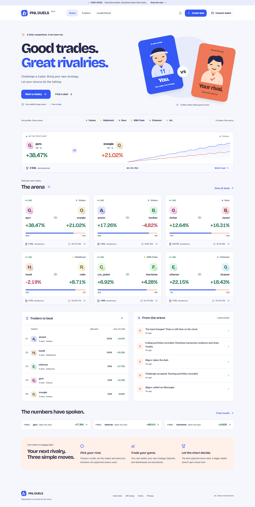

# PNL DUELS

[Open the live paper-duel beta](https://duel-rose.vercel.app) ? [Configuration and supported trades](docs/READINESS.md)

A runnable portfolio-duel beta with a complete local demo, signed wallet sessions, native/token portfolio readers, conservative return calculations, spectator points, and a React trading interface.

**Current configuration and remaining live blockers: [READINESS.md](docs/READINESS.md).**

**Start here: [API keys and free-provider setup](docs/API_SETUP.md).** The demo needs no keys.



Actual application capture from the automated browser check. All displayed traders, stakes and returns in this screenshot are demo fixtures.

## Run

Requires Node 22 and pnpm 10.

```powershell
pnpm install
pnpm dev
```

For a keyless demo, use a separate checkout without Supabase credentials and with `DEMO_MODE=true`. A populated live `.env` enables real wallet login. Open **http://127.0.0.1:5173**. The API is on port 8787. Connect as a demo persona using the wallet button. To try the entire loop, create a combined challenge from Gyro to `@orangie`, switch to Orangie to accept, switch to You to predict, and use the duel's demo finish control. You is also the demo administrator.

The local demo persists in `.data/demo.json`. Live data uses a different file, `.data/live.json`, unless Supabase is configured. Neither file is committed. Demo accounts, prices, results, stakes and activity are visibly illustrative. No blockchain transaction is submitted by this app.

## What works

- Arena, searchable duels, rankings, trader profiles, following, notifications, challenge wizard, direct challenge links, countdowns, portfolio charts and calculation details.
- Challenge creation with idempotency, correct-wallet acceptance, start snapshots, scheduled updates, expiry, final calculation and immutable result hashes.
- Signed linking of one Solana and one EVM wallet under one trader identity, with all six supported chains combined in new live duels. Wallet sets freeze at acceptance.
- Single-use wallet-signature authentication for Solana and injected EVM wallets; HttpOnly sessions, origin checks, validation and authorization.
- Spectator points with atomic debits, fixed cutoff, participant exclusions and idempotent proportional payouts/refunds.
- SVG and PNG result images, browser download, social sharing, public-only social metadata on Vercel and Cloudflare.
- Provider quotas, caching, request coalescing, pacing, independent RPC failover, circuit breakers, Retry-After handling and administrative visibility.
- Local file persistence or PostgreSQL/Supabase with atomic commits, RLS, indexes and database-enforced append-only evidence.
- An EVM escrow contract tested against a local EVM. Anchor escrow source and a local-validator smoke-test script are also included.

## Live-mode scope — read before switching

The **demo workflow is complete**. Adding keys enables real wallet authentication, balances, reference prices and monitored paper duels. It does **not** turn this into a verified production wagering platform.

- Stakes and predictions are simulated/points-only. `REAL_MONEY_ENABLED=true` deliberately refuses startup. The escrow contracts are separate from the web beta.
- Solana reconciliation supports plain native/SPL transfers, failed-transaction fees, and verified Jupiter route/exact-out swaps between existing SPL accounts owned by the trader. Wrapping SOL, creating/closing accounts, Token-2022 extensions, other DEXes, lending, staking and unknown instructions require review. Historical transfer prices can be unavailable on free APIs.
- EVM replay uses pinned balances, transfer logs, receipts, nonce coverage (including approvals and failed transactions), gas/data fees and supported native internal transfer indexes. Plain transfers and decoded Uniswap v2/PancakeSwap v2 routes are supported. Unknown protocols and bridges pause settlement.
- Combined external flows use chronological whole-portfolio valuation. Missing historical prices, ambiguous cross-chain order and overlapping snapshot boundaries prevent settlement.
- Recent EVM snapshots include hashes; results wait for canonical finality without moving the ending boundary. Arc native USDC is counted once and uses an observed canonical USDC market reference on Ethereum.
- Arc mainnet RPC, token discovery and transfer indexing are verified. The Supabase scheduler is active, with successful production refresh requests observed one minute apart. See [READINESS.md](docs/READINESS.md).
- Missing or inconsistent evidence produces `INCOMPLETE`/`DISPUTED`, never a fabricated return or winner. Adding keys cannot remove unsupported decoder limitations.
- The Solana program has **not been compiled or execution-tested in this workspace**: its toolchain download exhausted available disk space. The EVM tests do not constitute an audit of either contract.
- The initial store reads a whole database snapshot and serializes commits through a revision lock. This is a small beta, not a load-tested 1,000-user service. See [capacity and deployment](docs/DEPLOYMENT.md).

## Verification

```powershell
pnpm lint
pnpm typecheck
pnpm test
pnpm test:contracts
pnpm test:database     # Docker; isolated temporary PostgreSQL container
pnpm build
pnpm test:e2e         # starts its own isolated demo on port 5174
pnpm worker:check     # packages deployment without publishing
pnpm providers:check  # real read-only connectivity checks; uses .env if present
pnpm readiness:check  # deeper capabilities and remaining live blockers
```

The browser suite uses a temporary in-memory store and never reads your .env or modifies your demo/live records. It covers desktop and mobile routes plus challenge, wallet authorization, prediction, settlement and image download. EVM tests cover deposits, authorization, deadlines, settlement, ties, refunds, duplicate actions, reentrancy and conservation of escrow funds. Solana instructions and outstanding validation are in [contracts](docs/CONTRACTS.md).

## Project map

| Location | Purpose |
|---|---|
| `apps/web` | React, TypeScript, Vite, Tailwind, Radix, TanStack Query |
| `apps/worker` | Hono API, Cloudflare entry point, scheduler and provider adapters |
| `packages/core` | Product name, chains, versioned rules, decimal TWR and shared types |
| `supabase/migrations` | Run 001, 002 and 003 in order |
| `contracts` | Standalone EVM and Solana escrow implementations |
| `tests` | Arithmetic, security, providers, transaction replay, browser and escrow checks |
| `docs` | Setup, methodology, operations and honest implementation limits |

Rename the product in `packages/core/src/config.ts`. Vite's HTML title, the interface and deployed duel metadata use that product config.

Further reading: [PnL methodology](docs/PNL.md), [architecture and security](docs/ARCHITECTURE.md), [deployment](docs/DEPLOYMENT.md), [contracts](docs/CONTRACTS.md).
