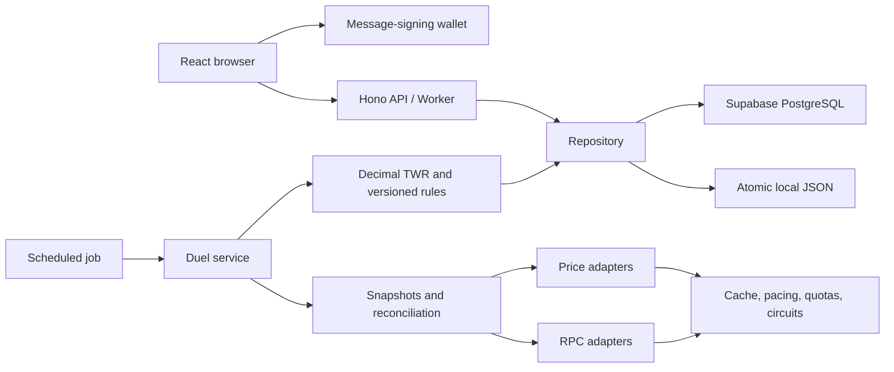

# Architecture and security

## Boundaries

React uses same-origin `/api` requests. It cannot access service credentials or database tables. The local server and Cloudflare Worker create the same Hono application. Vite proxies API/image requests in development. Static assets can be served without initializing the API. API keys exist only in environment variables or Worker secrets.

`Repository` isolates persistence. Local writes serialize through a queue and atomically rename a temporary file. Supabase reads a transactionally consistent state and commits only changed records with a global optimistic revision. Concurrent conflicting commits retry at most five times. Transact callbacks must have no external side effects because they may run again.

All data tables have RLS and deny anon/authenticated table access. The Worker uses a server service-role key. Read views project portfolio positions and ledger balances without duplicating the historical data. This JSON-record design with generated relational indexes prioritizes correctness and reviewability; it needs targeted SQL reads/writes before larger scale.

## Authentication and authorization

- Solana Ed25519 and EVM message signatures verify the wallet against a server-stored domain/chain-bound nonce.
- A profile links one Solana and one EVM address. Link challenges explicitly identify the target account and are bound to the same active session. A transaction enforces one account per wallet and rotates the session after a successful link. No network switch is needed for EVM portfolio tracking.
- Challenges expire in five minutes and are consumed atomically once. Wallet sessions last four hours in live mode.
- Cookies are HttpOnly, SameSite=Lax and Secure on HTTPS. Stored session IDs are hashes of random tokens and the application session secret.
- Mutating requests require the configured Origin, JSON content type and an application request header. Request bodies are limited to 16 KB.
- Only the challenged wallet can accept. Only participants can cancel an open challenge. Challenge creation has a per-wallet hourly limit and capacity limit.
- Prediction points use one atomic transaction for validation, prediction insertion and ledger debit. Concurrent requests cannot overspend; one prediction per wallet/duel is also constrained in PostgreSQL.
- Administrator authorization is an exact wallet allowlist, or the explicit You persona in demo mode. Admin changes are recorded. This is application access control, not a custody authority.
- Demo and live data require separate stores. Demo authentication and simulated completion endpoints are disabled in live mode.

Nonces and sessions are cleaned by the scheduler. Daily salted IP hashes are used in short-lived rate-limit counters. Requests emit IDs, method, route, status and latency without API keys. Production logging/retention and operating-entity policies still need owner configuration.

## Privacy

Unlisted duels are accessible to anyone with their link; they are not secret or wallet-gated. They do not appear in public feeds, public rankings/statistics, follower notifications or social-preview images. Do not use an unlisted duel for confidential information. Public blockchains and linked explorers remain public.

## Provider behavior

One cache/coalescing layer prevents identical concurrent upstream calls in an instance. Token prices are shared in persistence. Requests are paced, timeout after eight seconds, consume quota before dispatch, and are not retried indefinitely. Circuits cool down with bounded backoff and respect Retry-After. Independent public RPC hosts and Alchemy network hosts have separate health circuits while account budgets remain shared.

The app reserves the last 15% of estimated monthly quotas from optional work and the last 5% from normal live updates. Essential snapshots can use the remainder. DexPaprika additionally has a conservative rolling-window counter. No paid API host or auto-upgrade path exists. Provider dashboard metering, shared-IP traffic and other apps using the same key are outside these counters.

Provider-specific response schemas and chain checks reject malformed or mismatched data. Errors do not cause substitution of demo values. A cache hit is not represented as a fresh source observation.

## Trust and remaining work

This is a centralized analytics beta: the operator, RPC providers and market-data providers are trusted inputs. Liquidity and token-safety checks are incomplete. Mainnet escrow integration, complete EVM/DeFi decoders, stronger historical price/trace evidence, wallet smart-account authentication, full load testing and independent contract review remain before a real-money release. The frontend legal pages are labeled templates, not finished policies.

## Combined portfolios

New live duels record all enabled chains under `twr-portfolio-v1`, with a wallet manifest frozen at acceptance. Each parent snapshot contains one component per network, preserving its own block, time and positions. Eligible USD balances sum across components. Any missing component fails settlement checks. Historical database rows use JSON records, so these additional fields work with the installed migrations 001?003.
